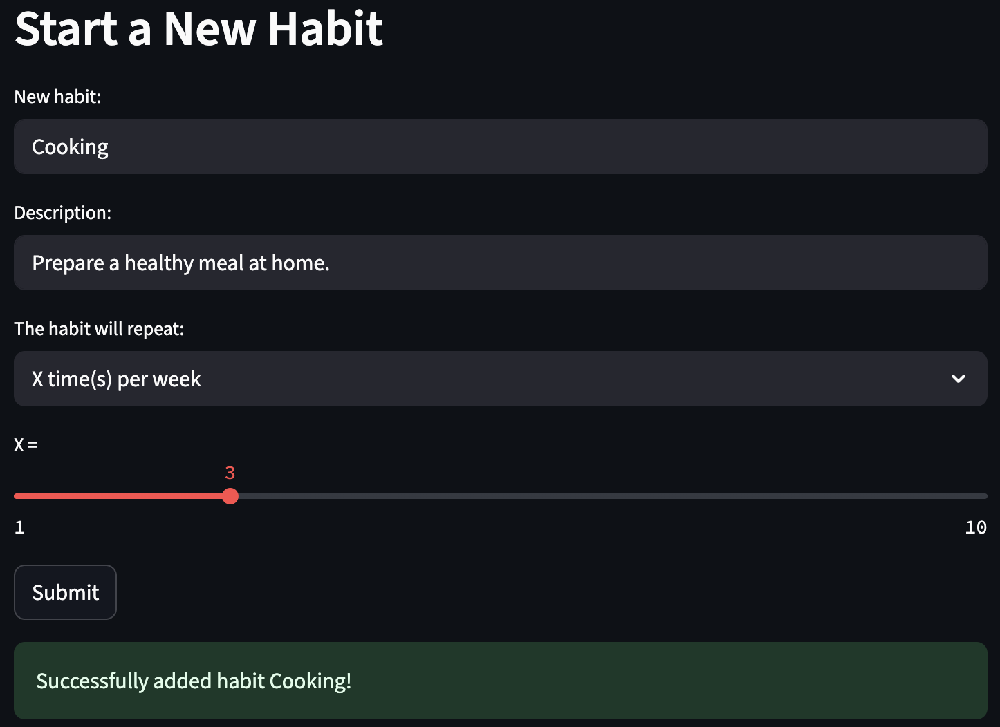
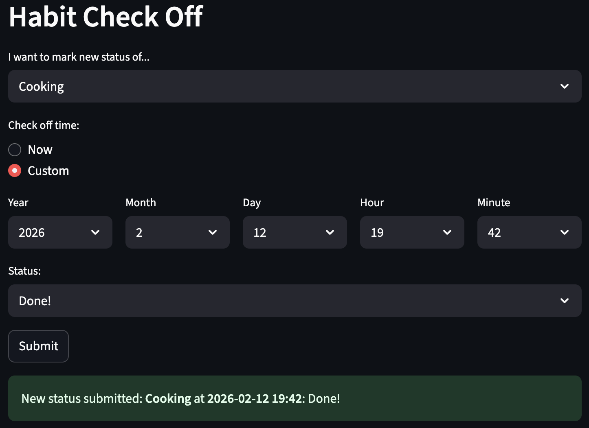
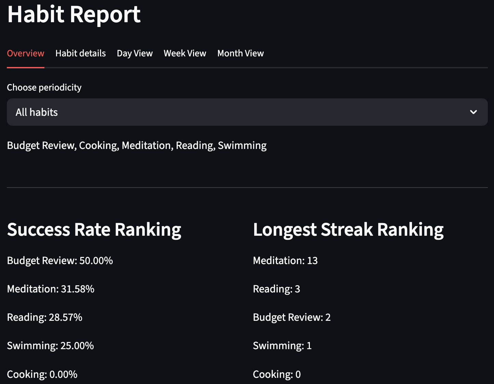

<h1 align="center"> Habit Tracker App </h1>

## Introduction
This habit tracker app helps users to track their habits. By defining habits with specific periodicities (daily, weekly or monthly)  and recording activities, users can easily monitor the progress by viewing the detailed records and the analytical report.

## Features
- **Habit Management:** Add new habits and delete unwanted habits. Support daily, weekly and monthly habits. 
- **Activity Logging:** Check off habits and mark the status as Done, Skip or Missed at any time.
- **Data Analytics:** Calculate the current streak, the longest streak and completion rate of habits.
- **Web UI:** Graphical user interface based on Streamlit makes the app intuitive and user friendly.
- **Data Storage:** Store user data in SQLite for tracking and analysis.
- **Predefined Data:** About four weeks of predefined data can be loaded to familiarize users with the application.

## Running the app locally
**1. Install Python (3.11 or 3.12) and Git if you don't have them**

**2. Clone the Repository**
```sh
git clone https://github.com/mong1913/habit-tracker.git
```

**3. Navigate to the App Directory**

**4. Create a Virtual Environment (Recommended)**
```sh
# Create a virtual environment with the specified Python version:
python3.12 -m venv venv
# or
python3.11 -m venv venv

# Activate the Environment 
# On macOS/Linux:
source venv/bin/activate
# On Windows:
.\venv\Scripts\activate
```

**5. Install dependencies**
```sh
pip install --upgrade pip
pip install -r requirements.txt
```

**6. Run the Streamlit App**
```sh
python -m streamlit run app.py
```

**7. Exit the App** <br>
Press Ctrl+C in the terminal window.

## Usage
**1. Create a new habit** <br>
Users can add a new habit on the Add Habit page. After entering the habit name, description and frequency, click the Submit button to save the habit to the database.


<br>

**2. Check off the habit** <br>
On the Check Off Habits page, users can log their progress by selecting one of the three statuses: Done, Skip, and Missed. Habits can be checked off at any time, including for past dates. Press the Submit button to save the record to the database.


<br>

**3. View habit report and data analysis** <br>
There are five tabs on the Analysis page.
- Overview: Provides a high-level summary, showing the habit ranking based on success rate and longest streak. 
- Habit details: See the detailed data of a specific habit or delete the habit if users no longer need it. 
- Day View: View activities on a specific day. 
- Week View: See all records for a full week. 
- Month View: View habit data for an entire month. 


<br>

## Demo
https://github.com/user-attachments/assets/862a4b13-19c6-4d59-90f4-f742b67d82c2
